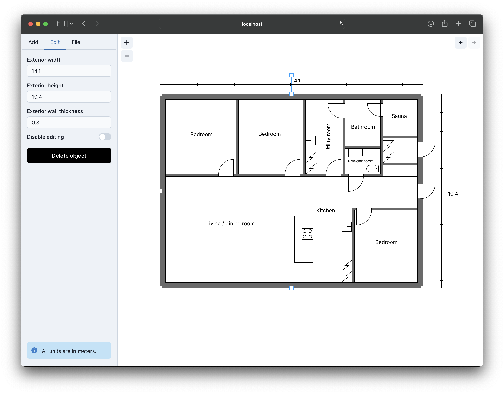

# Floor plan creator

The purpose of this project was to develop a frontend application for designing and drawing 2D floor plans for a house. The application was developed with TypeScript, React and Konva.js.



## Features

The application includes the following features:

- [x] Drawing an L-shaped or a rectangular house on the canvas.
- [x] Adding other shapes, including interior and exterior doors, walls, windows and kitchen appliances.
- [x] Resizing and rotating the shapes added on the canvas.
- [x] Snapping effect when a shape is being moved close to another shape to help moving the shape next to the other shape.
- [x] Zooming in and out the canvas using buttons.
- [x] Undo and redo buttons to undo/redo previous canvas operations.
- [x] Exporting a floor plan project into a JSON file.
- [x] Importing an existing floor plan project from a JSON file.

## Quickstart

- Clone the repository from GitHub.

- `cd` to the project directory.

- Install [Node.js](https://nodejs.org/en/download). This project was developed with the Node.js version `18.13.0`.

- Install dependencies by running the command:
    ```
    npm install
    ```

- For running end-to-end tests using Playwright, you can install the supported browsers with the command:
    ```
    npx playwright install
    ```

- Run the application with the command:
    ```
    npm run dev
    ```
    The application will be available on http://localhost:5173.

## Running end-to-end tests

This project contains some end-to-end tests which have been implemented using [Playwright](https://playwright.dev/). The tests can be run by launching the UI Mode with the command:
```
npm run test:e2e
```
Then, you can run all the tests by clicking the triangle icon in the sidebar. Notice that to be able to run E2E tests, you need to install the supported browsers as instructed in the [quickstart section](#quickstart).

You can also run the E2E tests in headless mode, which is useful in CI, for example. To run the tests in headless mode, use the command:
```
npm run test:e2e-ci
```
This command also requires that you have installed the supported browsers as described in the [quickstart section](#quickstart).

## Deployment

To build the application for deployment, run the following command:
```
npm run build
```
This command will produce an application bundle which can be served over a static hosting service. The application bundle will be outputted to a `dist` directory.
